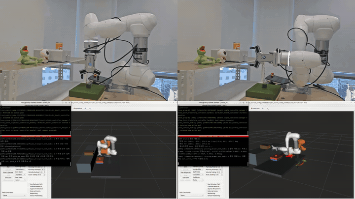
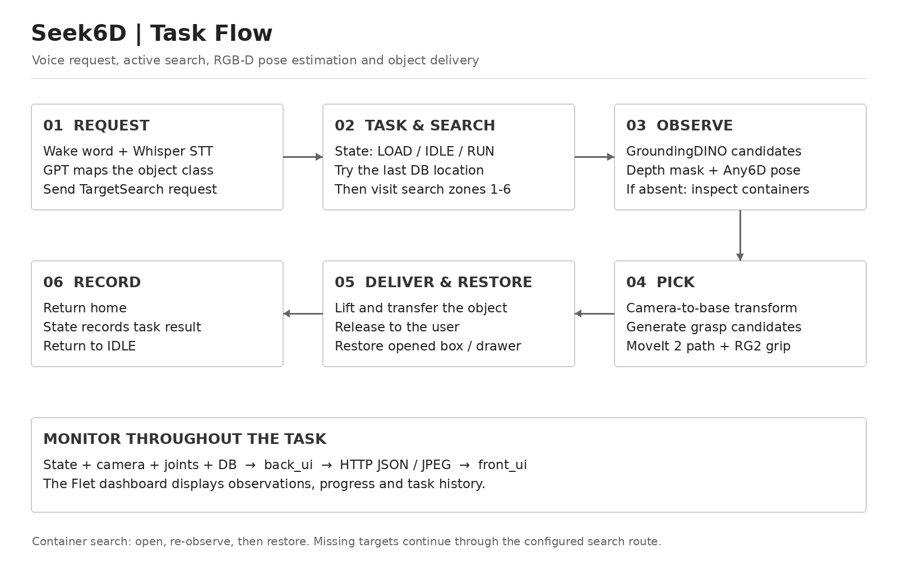
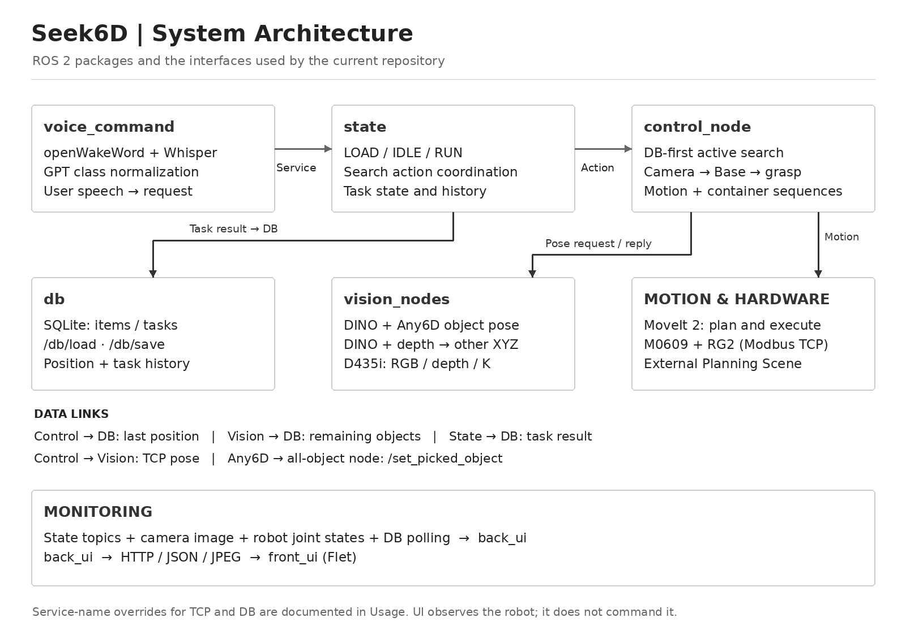
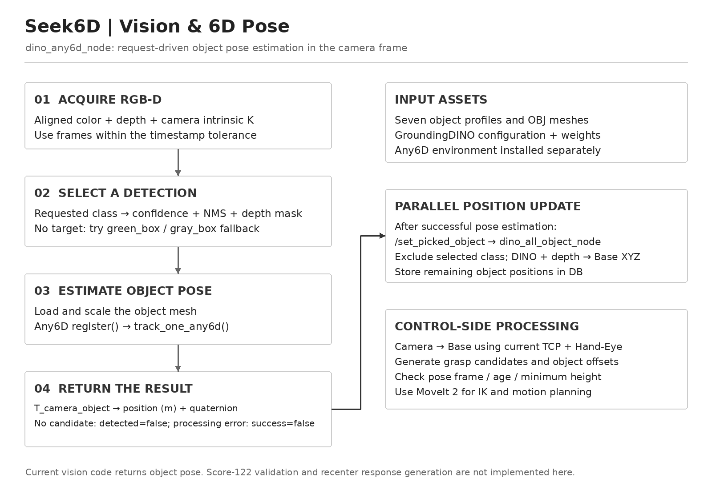
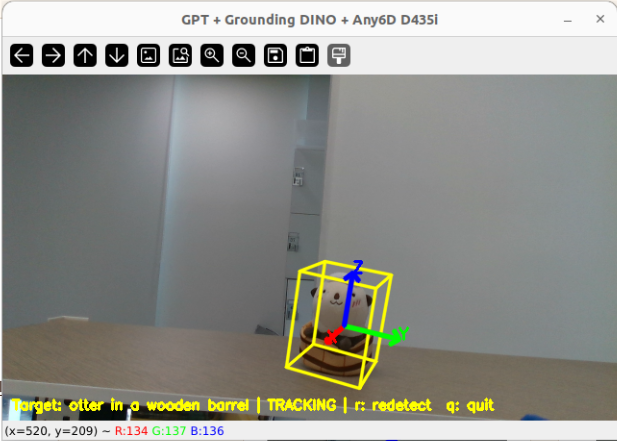
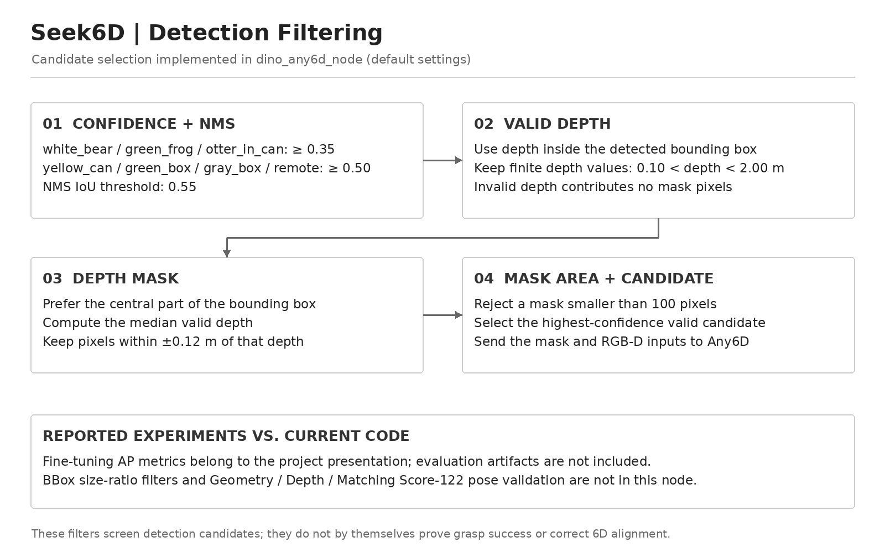
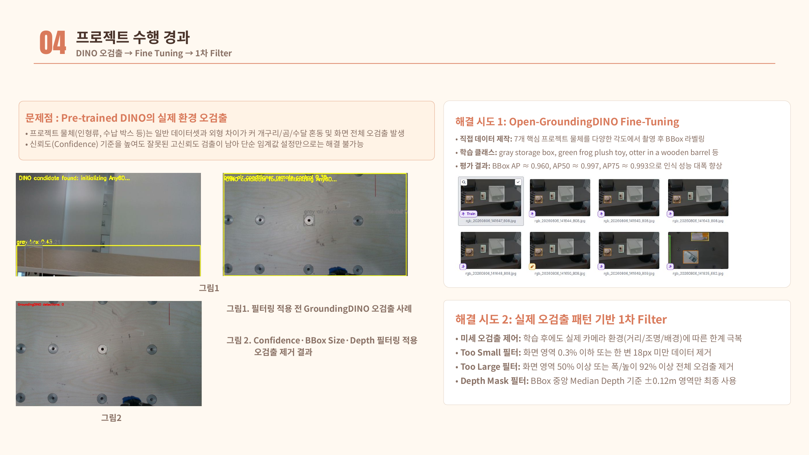
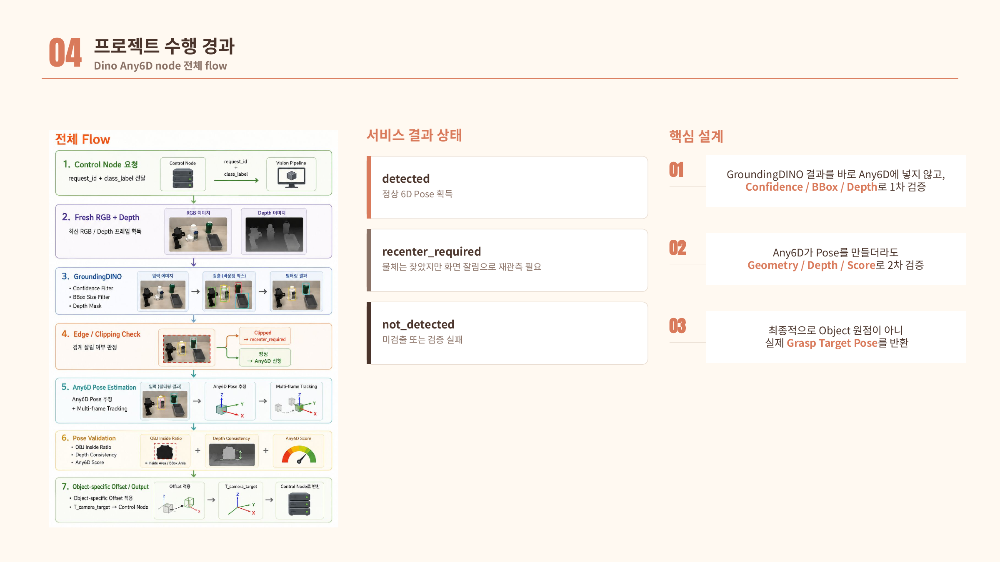

<div align="center">

# Seek6D

### Active Object Search & 6D Pose Grasping with Doosan M0609  
### Doosan M0609 협동로봇 기반 능동 탐색 · 6D Pose 파지 시스템

음성으로 요청한 물체의 위치를 몰라도, 주변을 탐색하고 서랍·보관함 내부까지 재관측해  
**GroundingDINO + Any6D + MoveIt 2**로 물체를 찾아 파지하는 ROS 2 기반 협동로봇 프로젝트

[](https://docs.ros.org/en/humble/)
[](https://ubuntu.com/)
[](https://www.python.org/)
[](https://www.doosanrobotics.com/)
[](https://moveit.ros.org/)
[](https://github.com/IDEA-Research/GroundingDINO)
[](https://github.com/)
[](https://www.intelrealsense.com/)
[](https://flet.dev/)
[](https://www.sqlite.org/)

</div>

---

## Overview

기존 물체 검출이 카메라 화면에 보이는 물체를 인식하는 데서 끝나는 것과 달리, 본 프로젝트는 **협동로봇이 물체를 스스로 탐색하고 찾아 파지**하도록 구성함.

DB에 저장된 마지막 위치를 우선 확인하고, 대상이 보이지 않으면 여러 탐색 구역을 이동하며 **서랍·보관함을 열어 내부를 재관측**함.  
이후 GroundingDINO와 Any6D로 대상의 위치와 자세를 추정하고, MoveIt 2로 충돌을 검사한 뒤 RG2 그리퍼로 파지함.

작업 상태, 탐색 단계, 카메라 영상, 물체 위치, 로봇 자세, 작업 이력은 **관측 전용 Flet 대시보드**에서 확인 가능함.

---

## Demo

<div align="center">
<table>
<tr>
<td align="center" width="50%"><b>Box Opening</b></td>
<td align="center" width="50%"><b>Search & Pick</b></td>
</tr>
<tr>
<td align="center" valign="top" width="50%">

</td>
<td align="center" valign="top" width="50%">

</td>
</tr>
<tr>
<td align="center" valign="top" width="50%">

</td>
<td align="center" valign="top" width="50%">

</td>
</tr>
<tr>
<td align="center" valign="top" width="50%">
<sub>보관함 손잡이를 파지하고 Cartesian 경로로 당겨 내부 탐색 공간 확보</sub>
</td>
<td align="center" valign="top" width="50%">
<sub>대상 탐색 → 6D Pose 추정 → UI로 상태 확인 → 파지</sub>
</td>
</tr>
</table>
</div>

---

## Key Contributions

1. **Active Search**  
   DB의 마지막 위치를 우선 확인하고, 미검출 시 사전 정의된 탐색 구역을 순회하며 재관측.

2. **Container Search**  
   서랍·보관함을 단순 장애물이 아닌 조작 가능한 탐색 공간으로 처리. 직접 열고 내부를 재관측.

3. **Detection Filtering + 6D Pose**  
   GroundingDINO Fine-Tuning, 클래스별 Confidence · NMS · Depth Mask 필터로 후보를 고른 뒤 Any6D로 Camera 기준 6D Pose 추정.

4. **Collision-aware Manipulation**  
   Camera → Base 좌표 변환 후 MoveIt 2 IK · 관절 제한 · 충돌 검사 기반으로 접근 및 파지.

5. **Monitoring-only UI**  
   ROS 2 환경과 분리된 Flet 대시보드. 로봇 제어 명령은 전달하지 않고 상태 확인만 수행.

---

## System

<div align="center">
  
  <br>
  <sub>요청 → 탐색 → 관측 → 파지 → 전달 · 원상복구 → 기록, 전 과정은 UI에서 모니터링</sub>
</div>

<br>

```text
USER
 │
 ▼
Wake Word → Whisper STT → GPT Object Mapping
 │
 ▼
State Manager (LOAD / IDLE / RUN)
 │
 ▼
DB Last Position Check
 │
 ├─ known location ───────────────┐
 │                               │
 └─ unknown / not detected       │
          │                      │
          ▼                      │
 Search Zones 1-6 / Box Open     │
          │                      │
          └──────────┬───────────┘
                     ▼
             GroundingDINO
                     ▼
     Confidence / NMS / Depth Mask
                     ▼
                Any6D Pose
                     ▼
             Camera → Base
                     ▼
             MoveIt 2 + RG2
                     ▼
           Pick / Transfer / Restore
                     ▼
               DB + Monitoring UI
```

<div align="center">

| Phase | Description |
|:---|:---|
| **1. Command** | 음성 명령 수신 및 대상 클래스 정규화 |
| **2. Search** | DB 최근 위치 우선 관측, 미검출 시 탐색 구역 1 ~ 6 순차 이동 |
| **3. Container** | 대상이 없으면 `green_box`, `gray_box` 보관함을 찾아 개방 후 내부 재관측 |
| **4. Perception** | GroundingDINO 검출 → Confidence · NMS · Depth Mask 필터 → Any6D 6D Pose |
| **5. Manipulation** | Camera → Base 변환, MoveIt 2 IK · 충돌 · 관절 제한 검증 후 RG2 파지 |
| **6. Restore** | 이송 및 보관함 원상복구, 결과와 물체 위치를 DB에 기록 |

</div>

---

## System Architecture

<div align="center">
  
  <br>
  <sub>ROS 2 패키지 구성과 Service / Action / DB 데이터 흐름</sub>
</div>

<br>

<div align="center">

| Package | Role |
|:---|:---|
| `interfaces` | 전체 노드가 공유하는 ROS 2 `srv` / `action` 인터페이스 |
| `voice_command` | 웨이크워드, Whisper STT, GPT 객체명 정규화 |
| `state` | `LOAD → IDLE → RUN` 상태머신, 작업 접수 및 Search Action 조정 |
| `control_node` | DB 위치 확인, 탐색, 좌표 변환, MoveIt 2 모션, RG2 파지, 서랍/보관함 동작 |
| `vision_nodes` | GroundingDINO 탐지, 후보 필터링, Any6D 6D Pose, 나머지 물체 위치 DB 갱신 |
| `db` | SQLite 기반 `items` / `tasks` 저장·조회 |
| `back_ui` | ROS 2 데이터를 HTTP / JSON / JPEG로 변환 |
| `front_ui` | Flet 기반 모니터링 전용 UI |

</div>

---

## Vision & 6D Pose

<div align="center">
  
  <br>
  <sub><code>dino_any6d_node</code> — 요청 기반 Camera 좌표계 6D Pose 추정 흐름</sub>
</div>

<br>

- **GroundingDINO**: 어떤 물체가 영상의 어디에 있는가 → Bounding Box + Confidence
- **Any6D**: 그 물체가 3차원 공간에서 어디에 있고 어떤 방향인가 → Position + Rotation
- RGB, Depth, Object Mask, Camera Intrinsic, 3D Mesh로 `T_camera_object` 추정

<div align="center">

| Step | Description |
|:---|:---|
| **1. Acquire RGB-D** | 정렬된 Color + Depth + Intrinsic `K`, 타임스탬프 허용 오차(80 ms) 이내 프레임만 사용 |
| **2. Select a Detection** | 요청 클래스 검출 → Confidence · NMS · Depth Mask 필터, 대상이 없으면 `green_box` / `gray_box` fallback 검출 |
| **3. Estimate Object Pose** | 물체 Mesh 로드 · 실제 높이로 Scale 보정 → Any6D `register()` → `track_one_any6d()` |
| **4. Return the Result** | `T_camera_object` → position (m) + quaternion 반환, 후보 없음은 `detected=false`, 처리 오류는 `success=false` |

</div>

- 응답 Pose는 항상 **Camera 기준**이며, Camera → Base 변환 · Grasp 후보 생성 · MoveIt 2 IK는 `control_node`에서 처리

### Node 분리

<div align="center">

| Node | 목적 | 주요 출력 |
|:---|:---|:---|
| `dino_any6d_node` | **정밀 파지**가 필요한 단일 대상 | Camera 기준 Target 6D Pose |
| `dino_all_object_node` | 남아 있는 **전체 물체 위치 관리** | Robot Base 기준 XYZ + DB Update |

</div>

모든 물체에 Any6D를 반복 적용하면 연산량이 커지므로, 정밀 파지와 전체 상태 관리 역할을 분리함.  
Pose 추정이 성공하면 `/set_picked_object`로 선택 클래스와 요청 시점 TCP Pose를 넘기고, `dino_all_object_node`가 **선택된 물체를 제외한 나머지**를 DINO + Depth로 Base XYZ 변환해 DB에 저장함.

<div align="center">
<table>
<tr>
<td align="center" width="50%"><b><code>dino_any6d_node</code></b></td>
<td align="center" width="50%"><b><code>dino_all_object_node</code></b></td>
</tr>
<tr>
<td align="center" valign="top" width="50%">

</td>
<td align="center" valign="top" width="50%">

</td>
</tr>
<tr>
<td align="center" valign="top" width="50%">
<sub>단일 대상 검출 후 6D Pose 추정</sub>
</td>
<td align="center" valign="top" width="50%">
<sub>시야 내 여러 물체 동시 검출</sub>
</td>
</tr>
</table>
</div>

### Detection Filtering

<div align="center">
  
  <br>
  <sub><code>dino_any6d_node</code> 기본 설정 기준 후보 선택 과정</sub>
</div>

<br>

Pre-trained GroundingDINO에서 인형류와 박스류 오검출이 발생하여, 프로젝트 물체 7종으로 **Open-GroundingDINO Fine-Tuning** 후 아래 필터로 Any6D 입력 후보를 선별함.

<div align="center">

| Stage | Rule |
|:---|:---|
| **01 Confidence + NMS** | 인형류(`white_bear`, `green_frog`, `otter_in_can`) ≥ 0.35 · 그 외 ≥ 0.50, NMS IoU 0.55 |
| **02 Valid Depth** | BBox 내부 Depth 중 0.10 m < depth < 2.00 m 인 유효값만 사용 |
| **03 Depth Mask** | BBox 중앙부 우선, 유효 Depth의 Median 기준 ±0.12 m 픽셀만 Mask로 유지 |
| **04 Mask Area + Candidate** | Mask 100 px 미만 제외, 남은 후보 중 최고 Confidence를 선택해 Mask + RGB-D를 Any6D로 전달 |

</div>

> 필터는 **검출 후보를 거르는 단계**이며, 그 자체로 파지 성공이나 6D 정합의 정확성을 보장하지는 않음.

<details>
<summary><b>발표 자료 — Fine-Tuning 결과와 실험 단계 검증</b></summary>

<br/>

<div align="center">
  
  <br><br>
  
</div>

<br>

<div align="center">

| Metric (Fine-Tuning) | Result |
|:---:|:---:|
| BBox AP | **≈ 0.960** |
| AP50 | **≈ 0.997** |
| AP75 | **≈ 0.993** |

</div>

- AP 수치는 발표 자료 기준이며, 평가 산출물은 저장소에 포함되어 있지 않음
- BBox Size-Ratio 필터와 Geometry / Depth / **Any6D Matching Score 122** 기반 Pose 검증은 실험 단계에서 사용했으며, 현재 `dino_any6d_node`에는 포함되지 않음

</details>

### Supported Objects

<div align="center">

| Class ID | Object |
|:---|:---|
| `yellow_can` | 노란 캔 |
| `green_box` | 초록 박스 |
| `gray_box` | 회색 박스 / 서랍 |
| `white_bear` | 흰색 곰 인형 |
| `aircon_remote` | 에어컨 리모컨 |
| `green_frog` | 초록 개구리 인형 |
| `otter_in_can` | 수달 인형 |

</div>

### Mesh Preparation

- **복잡한 비정형 물체**: Hunyuan3D-2 기반 Mesh 생성
- **캔 · 박스 등 단순 형상**: Any6D Auto Mesh
- 실제 물체 크기에 맞춰 Scale 보정, Texture / UV 형식 정리 후 Any6D에 입력

---

## Robot Control & Manipulation

### MoveIt 2 Planning

```text
Target TCP Pose
      ↓
Inverse Kinematics
      ↓
Joint Limit / Self Collision Check
      ↓
Planning Scene / OctoMap
      ↓
Collision-free Path
      ↓
Trajectory Timing
      ↓
Doosan M0609 Execution
```

- 정밀 파지 구간은 물체에 직선으로 접근해야 하므로 **Cartesian 경로**를 사용해 접근 안정성 확보

### Camera → Base Transformation

Eye-in-Hand 구조에서 카메라 Pose를 현재 TCP와 Hand-Eye Calibration 결과로 계산함.

```text
T_base_grasp
  = T_base_tcp
  × T_tcp_camera
  × T_camera_grasp
```

최종 Base 기준 Position / Quaternion을 MoveIt 2 목표 Pose로 전달함.

### Drawer / Box Search

```text
Handle Approach
   ↓
Grip + Planning Scene Attach
   ↓
Cartesian Pull
   ↓
Detach / Retreat / Lift
   ↓
Move Camera Above Drawer
   ↓
Re-detect Object
   ↓
Update Scene
```

- 서랍 각도에 따라 특정 접근 방향에서 IK 해가 없는 문제를 줄이기 위해 접근 방위각 후보를 순회
- **전체 경유 Pose가 모두 가능한 경로를 실행 전에 선택**

---

## Monitoring UI

<div align="center">
  
  <br>
  <sub>Robot monitoring dashboard</sub>
</div>

<br>

```text
ROS 2 Nodes
   │
   ├─ Joint States
   ├─ Task / System State
   ├─ Camera Image
   └─ DB Polling
        │
        ▼
     back_ui
   HTTP / JSON / JPEG
        │
        ▼
     front_ui
```

- 작업 상태 및 시스템 노드 준비 상태
- 현재 탐색 단계와 진행 상황
- 실시간 카메라 영상
- 물체 위치와 로봇을 표현한 3D Map
- 최근 작업 결과와 성공 / 실패 이력
- `front_ui`는 ROS 2에 직접 의존하지 않고 HTTP 폴링을 사용해 실행 환경 분리

---

## Engineering Challenges

<div align="center">

| Problem | Solution |
|:---|:---|
| DINO 고신뢰도 오검출 | 프로젝트 7개 물체 직접 Fine-Tuning + 클래스별 Confidence · NMS 필터 |
| BBox 안에 배경이 섞여 Pose 정합이 흔들림 | BBox 중앙 Median Depth ±0.12 m Mask만 Any6D에 입력, 100 px 미만 Mask 제외 |
| 요청 물체가 시야에 없음 | `green_box` / `gray_box` fallback 검출 → 보관함 개방 후 재관측 |
| 모든 물체에 Any6D 적용 시 연산량 과다 | 파지 대상만 Any6D, 나머지는 `dino_all_object_node`가 DINO + Depth로 위치만 갱신 |
| 서랍 각도에 따라 IK 해가 없음 | 접근 방위각 후보를 순회해 전체 경유 Pose가 가능한 방향을 사전 선택 |
| 동적 서랍과 충돌 가능성 | 파지 중 Planning Scene attach, 개방 후 위치 갱신 및 detach |
| 좌표계가 여러 단계로 분리됨 | Hand-Eye Matrix와 현재 TCP로 Camera → Base 변환 후 MoveIt Target 생성 |

</div>

---

## Environment

<div align="center">

| Category | Specification |
|:---|:---|
| OS / Middleware | Ubuntu 22.04, ROS 2 Humble |
| Language | Python 3.10 (`front_ui`는 Python 3.11) |
| Robot | Doosan Robotics M0609 |
| Motion Planning | MoveIt 2, OMPL, Planning Scene / OctoMap |
| Gripper | OnRobot RG2, Modbus TCP |
| Camera | Intel RealSense D435i, Eye-in-Hand |
| Detection | GroundingDINO / Open-GroundingDINO |
| 6D Pose | Any6D |
| 3D Mesh | Hunyuan3D-2, Any6D Auto Mesh, Blender / trimesh |
| Voice | openWakeWord, Whisper, GPT |
| Data | SQLite3 |
| UI | Flet, HTTP JSON / JPEG polling |

</div>

실제 로봇 구동 시 필요 항목

- Doosan M0609 Driver + MoveIt 2 configuration
- OnRobot RG2, Intel RealSense D435i
- Eye-in-Hand Calibration
- OpenAI API Key (`voice_command` 사용 시)
- GroundingDINO / Any6D 전용 환경

---

## Installation

```bash
mkdir -p ~/cobot_ws/src
cd ~/cobot_ws/src

git clone <REPOSITORY_URL> seek6d

cd ~/cobot_ws
source /opt/ros/humble/setup.bash
rosdep update
rosdep install --from-paths src --ignore-src -r -y
```

`interfaces`를 먼저 빌드한 뒤 전체 패키지를 빌드.

```bash
cd ~/cobot_ws
source /opt/ros/humble/setup.bash

colcon build --packages-select interfaces
source install/setup.bash

colcon build --symlink-install
source install/setup.bash
```

---

## Usage

### 1. Doosan + MoveIt 2

```bash
ros2 launch dsr_moveit_config_m0609 start_2.launch.py \
  mode:=real model:=m0609 name:=dsr01 host:=<ROBOT_IP> gui:=true
```

### 2. DB

```bash
ros2 run db db_node
```

### 3. Control

```bash
ros2 launch control_node control_node.launch.py
```

### 4. Vision

```bash
# GPU / dedicated conda env
conda activate <VISION_ENV>
ros2 launch vision_nodes vision_nodes.launch.py
```

### 5. Back UI

```bash
ros2 run back_ui node
```

### 6. State Manager

```bash
ros2 run state state_node
```

### 7. Voice Command

```bash
ros2 run voice_command voice_command_node
```

### 8. Front UI

```bash
conda activate front_ui
cd ~/cobot_ws/src/seek6d/front_ui
flet run
```

> `control_node`는 MoveIt 2의 `/joint_states`, TF, planning / execution 인터페이스가 먼저 준비되어야 안정적으로 기동됨.

<details>
<summary><b>Robot 없이 UI만 실행</b></summary>

<br/>

```bash
# Terminal 1
conda activate front_ui
cd ~/cobot_ws/src/seek6d/front_ui
python tools/fake_server.py

# Terminal 2
conda activate front_ui
cd ~/cobot_ws/src/seek6d/front_ui
flet run
```

`fake_server.py`는 `back_ui`와 동일한 HTTP 계약으로 가상의 상태를 제공.

</details>

---

## ROS 2 Interfaces

<div align="center">

| Interface | Type | Data Flow | Role |
|:---|:---:|:---|:---|
| `/state/target_search` | Service | Voice → State | 대상 물체 탐색 요청 |
| `/control/search` | Action | State ↔ Control | 탐색 · 파지 실행 및 진행률 피드백 |
| `/find_object_pose` | Service | Control ↔ Vision | Camera-frame 6D Pose 요청 |
| `/db/load`, `/db/save` | Service | Control / State ↔ DB | 물체 위치 및 작업 기록 조회 / 저장 |
| `/state/robot_result` | Service | Control → State | 작업 성공 / 실패 결과 보고 |
| `/ui/task_state` | Topic | State → Back UI | 작업 상태 모니터링 데이터 |
| `/state/current` | Topic | State → Back UI | 시스템 상태 |
| `/camera/camera/color/image_raw` | Topic | D435i → Back UI | 카메라 영상 |
| `/dsr01/joint_states` | Topic | M0609 → Back UI | 현재 관절 상태 |
| `/state`, `/health`, `/frame.jpg` | HTTP | Back UI → Front UI | UI 표시용 JSON / JPEG |

</div>

---

## Database

기본 DB 경로

```text
~/.ros/robot_db/robot.db
```

### `items`

마지막으로 확인된 물체 위치를 `class_name` 기준으로 갱신.

<div align="center">

| Column | Description |
|:---|:---|
| `class_name` | 객체 ID |
| `confidence` | 검출 신뢰도 |
| `x`, `y`, `z` | Robot Base 기준 위치 |
| `last_seen` | 마지막 관측 시간 |

</div>

### `tasks`

작업 종료 시 성공 / 실패 / 취소 결과를 저장.

<div align="center">

| Column | Description |
|:---|:---|
| `voice_command` | 사용자가 말한 원문 |
| `target_name` | 대상 물체 |
| `status` | `SUCCEEDED` / `FAILED` / `ABORTED` |
| `fail_stage` | 실패 단계 |
| `fail_reason` | 실패 원인 |
| `found_at` | 발견 위치 |
| `started_at`, `ended_at` | 작업 시작 / 종료 시간 |

</div>

---

## Current Limitations & Future Work

**Limitations**

- **6D Pose 좌표축 오차**: 물체 자세와 관측 방향에 따라 Any6D 추정 축이 흔들려 정밀 접근에 오차 발생 가능
- **Occlusion / Edge View**: 화면 가장자리에 있거나 일부 가려진 경우 Detection 및 Mesh 정합 정확도 저하
- **Processing Time**: 탐색 → Detection → Pose → Robot Move → Re-detection이 이어지며 작업 시간 증가
- **Pose Validation / Recenter**: Matching Score 기반 Pose 검증은 실험 단계에만 적용됨. `control_node`는 `recenter_required` 응답을 처리할 수 있으나 현재 Vision 노드는 이를 생성하지 않음
- **TF Tree Integration**: Base, TCP, Camera Frame 변환이 하나의 TF Tree로 통합되지 않아 일부를 Service와 Hand-Eye Matrix에 의존

**Future Work**

1. 실험 단계의 Geometry / Depth / Matching Score 검증을 Vision 노드에 통합하고 `recenter_required` 응답 생성
2. RGB-D 및 형상 정보를 활용한 Pose 안정화와 좌표축 보정
3. 가림 · 잘림 상태에 따른 Next-Best-View 재관측
4. 후보 영역 우선순위화 및 결과 재사용을 통한 탐색 · 추론 속도 최적화
5. Camera → TCP → Base → MoveIt Target 좌표 변환 구조 단순화 및 TF 통합

---

## Repository Structure

```text
seek6d/
├── assets/           # README 이미지 · 데모
├── interfaces/       # 공용 srv / action 정의
├── db/               # SQLite items / tasks DB 노드
├── state/            # 상태머신 + 통합 launch
├── control_node/     # MoveIt 2 기반 탐색 · 파지 · 이송 제어
├── back_ui/          # ROS 2 ↔ HTTP 어댑터
├── front_ui/         # Flet 모니터링 UI
│   ├── src/
│   ├── tools/
│   └── tests/
├── voice_command/    # Wake Word + STT + LLM 명령 처리
├── vision_nodes/     # GroundingDINO + Any6D
└── README.md
```

각 패키지의 세부 설정과 실행법은 패키지 내부 `README.md` 참고.

---

<div align="center">

**ROS 2 × Doosan Robotics × OnRobot × MoveIt 2 × Flet**

Find it. Observe it. Pick it.

</div>
